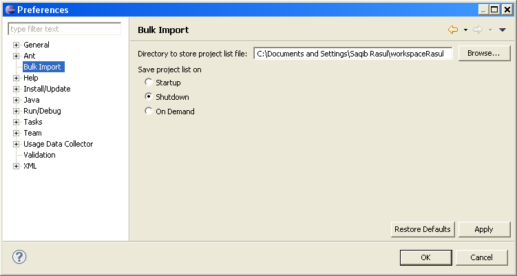
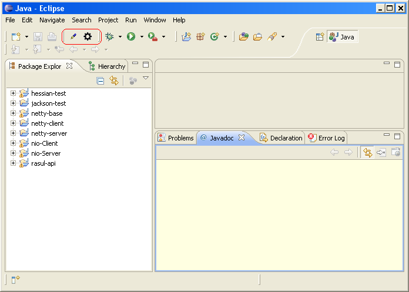

# Eclipse Bulk Import
## About
At my place of work, we have lots of eclipse projects. The base platform is composed of over 200 eclipse projects. Now, I’m not really sure if anyone ever uses eclipse with over 200 projects. There are some issues with such an eclipse setup:

1. Eclipse workspaces get corrupt every now and then: new workspace, import projects, wait. This cycle can take appox an hour and still lead to corrupt workspace. (once I spent an entire day doing this!)
2. Importing these projects takes time because you have to select a bunch of projects
3. Importing over 200 projects and then build takes eclipse appox 30-40 mins depending on the hardware
4. A functioning eclipse with over 200 projects is needed before one can do anything productive

And so after looking for such a plugin that would allow me to import a predefined list or projects, and not finding one, I decided to write one myself.

## Features
* saves the list of projects in the current workspace
* is able to bulk-import this list of projects in another or the same workspace
* can help to recover from corrupt workspaces


## Screen Shots
Here is an example to the plugin in action. In this video i remove some projects from my workspace. The plugin has already saved the list of current projects. So with one click, I can re-import them:
[](http://www.youtube.com/watch?v=E-NPWg7isS0)

## Download
Download the plugin jar from the github here
Source is also here.

### Installation
Place the BulkImportPlugin_1.0.0.jar in your $eclipse_dir/plugins/ directory. Restart Eclipse.

## Usage
Once installed, you will have 2 buttons on the eclipse gui to:

1. Save the current list of projects
2. import projects from a saved list of projects

In Window -> Preferences -> Bulk Import you have some options as to where to save the project List and when it should be saved


And thats about it. When configured to save on shutdown, each time you quit eclipse, it will save the current list of projects in your workspace. Apart from that there are 2 buttons in eclispe to save or load projects on demand



| Symbol | Action | 
|---|---|
|  | Save location of current open projects |
|  | Open projects from saved-project-location list |

## Recovering From Corrupt Workspaces
With a corrupt workspace I notice that the only thing that helps is to create a new workspaces and import all the projects into that. And so I assumed that a corrupt workspace seems to have to do with the current projects you have in you workspace and eclipse not being able to work with them. Googleing around, i found that in case of corrupt workspaces you can delete the following directory:
```
/path/to/my/workspaces/.metadata/.plugins/org.eclipse.core.resources/
```
and then re-import the projects. Using this plugin you can delete this directory, restart eclipse and one-click import your previous projects.
